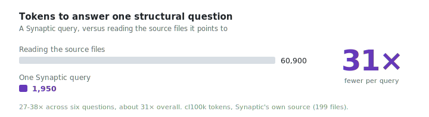

# Synaptic

<p align="center">
  <a href="https://discord.gg/ytX7R2PbNz"></a>
  <a href="LICENSE"></a>
  <a href="https://github.com/ColinVaughn/Synaptic/releases"></a>
</p>

<p align="center">
  <a href="https://discord.gg/ytX7R2PbNz"></a>
</p>

Turn any folder of code into a persistent, queryable **knowledge graph**, then work over that
graph instead of re-reading the codebase. Synaptic extracts symbols and relationships across
30+ languages with [tree-sitter](https://tree-sitter.github.io/), clusters them into
communities, and surfaces the structurally important pieces. It scales with your codebase:
from a single small folder to a large **monorepo**, or a fleet of **separate repositories
federated into one graph** — with real cross-repo edge resolution that keeps architecture
visible across repo boundaries.

On top of the graph it answers structural and architectural queries, traces reverse impact
("what would this change break?"), forecasts and speculatively runs a change before you make
it, plans safe refactors, diffs architecture across git history, and audits SQL for
performance and security. It is a single static Rust binary (`synaptic`) with no runtime and
no interpreter, writes machine-readable graphs alongside human-readable reports and 2D/3D/SVG
visualizations, and ships an MCP server so an AI coding assistant can run all of that before
grepping or reading files.

---

## Why

- **Structural clarity.** God nodes, surprising cross-module connections, import cycles, and
  community structure are computed for you.
- **Impact and foresight.** Reverse impact, change forecasting, and speculative test runs
  answer "what depends on this?" and "what would this change break?" before you touch the code.
- **Token economy.** Querying a compact graph costs a fraction of feeding raw files to an
  LLM, so an assistant can answer those questions without loading the repo.
- **Confidence you can audit.** Every inferred relationship is tagged `EXTRACTED`,
  `INFERRED`, or `AMBIGUOUS`.
- **Scales past one repo.** A workspace can federate many repos with real cross-repo edge
  resolution (export surfaces plus import / tsconfig / module-federation aliases).
- **Offline by default.** A code-only corpus never makes a network call. The optional
  semantic pass over docs and papers is the only feature that needs an API key.

## Highlights

- **30+ languages** via tree-sitter, each built and tested in isolation in CI, plus
  regex-based extractors for a few formats and script extraction for Vue/Svelte/Astro and
  Razor/Blazor. See [Languages](https://github.com/ColinVaughn/Synaptic/wiki/Languages).
- **One command to a full graph** plus 2D, 3D, and SVG visualizations, a Markdown report,
  and GraphML / Cypher / DOT / Obsidian / wiki exports. See [Output Formats](https://github.com/ColinVaughn/Synaptic/wiki/Output-Formats).
- **Graph queries**: relevant-subgraph search, shortest path, node explanation, and
  reverse-impact ("what depends on this"). See [Querying](https://github.com/ColinVaughn/Synaptic/wiki/Querying).
- **Time-travel diff**: `synaptic diff <rev1> [rev2]` (or `--since <date>`) reports how the
  graph changed between two git revisions, added/removed dependencies, removed APIs,
  architectural drift, new cycles, and hotspots, with a Markdown or self-contained HTML report.
- **Architectural search (SYNQL)**: `synaptic search` runs a small Cypher-inspired query
  language over the graph, matching on structure (kind, visibility, LOC, fan-in/out,
  variable-length paths) with `count(...)` aggregation, `--explain`, saved queries, and a
  library of named patterns (singleton, factory, observer, service-locator, god-class). Not
  text search.
- **Safe refactor**: `synaptic refactor rename` / `move` / `extract` emit a confidence-scored
  execution plan (`plan.json` + `plan.md`) for an AI agent to apply, then `refactor verify`
  rebuilds and checks the graph held (the definition moved/renamed, no references lost, no new
  cycles). Synaptic never edits source itself.
- **Change forecasting and speculative execution**: `synaptic predict` forecasts a change's
  blast radius, public APIs at risk, at-risk tests, new cycles, risk score, and a verify
  checklist before you edit (`--edit "<kind>:<symbol>"` forecasts a described edit before any
  code is written); `synaptic speculate` then applies the change in a throwaway git worktree
  and actually runs the at-risk tests plus a build/type-check, reporting real pass/fail — the
  ground-truth half of prediction; and `synaptic eval replay` replays history to score forecast
  quality against git ground truth (co-edited tests, removed APIs), turning prediction accuracy into
  a CI-gateable metric. See
  [Commands](https://github.com/ColinVaughn/Synaptic/wiki/Commands).
- **SQL performance & security audit**: `synaptic sql audit` flags row-level-security gaps,
  over-broad grants, likely SQL injection, missing indexes on filter/foreign-key columns,
  `SELECT *`, non-sargable predicates, N+1 patterns, and missing primary keys over the SQL-aware
  graph (extraction now models columns, indexes, RLS policies, and grants, and links application
  queries to the tables they touch). `synaptic sql advise --query "<sql>"` critiques a candidate
  query before you write it, cross-referenced against the graph's tables/indexes/RLS. See
  [SQL Auditing](https://github.com/ColinVaughn/Synaptic/wiki/SQL-Auditing).
- **MCP server** (protocol 2025-11-25) exposing 26 read-only tools over stdio or HTTP:
  subgraph search, source reading, reverse-impact, PR/working-tree blast radius, change
  forecasting, predictive test selection, edit-impact prediction, structural search, time-travel
  diff, plan-only rename, and SQL audit/advise, plus prompts, completions, resource subscriptions,
  and structured tool output. See
  [MCP Server](https://github.com/ColinVaughn/Synaptic/wiki/MCP-Server).
- **Incremental rebuilds**, file watching, and git hooks keep the graph current. See
  [Incremental Updates](https://github.com/ColinVaughn/Synaptic/wiki/Incremental-Updates).
- **Graph-aware PR dashboard** with blast radius and merge-order conflict detection. See
  [PR Dashboard](https://github.com/ColinVaughn/Synaptic/wiki/PR-Dashboard).

---

## Token economy

A core payoff of querying a compact graph is **reading a small answer instead of the whole
codebase**. Measured on Synaptic's own source (199 Rust files, 56,408 lines, **510,966**
`cl100k` tokens), one `query_graph` answer to a structural question is **~1,950 tokens**
(bounded by its token budget), versus reading the source files that answer actually touches:

<picture>
  <source media="(prefers-color-scheme: dark)" srcset="assets/token-economy-dark.svg">
  
</picture>

Across six questions spanning different subsystems, querying the graph used **27-38x fewer
tokens** (about **31x overall**) than reading the files the answer references:

| Question | Query response | Read the files | Fewer tokens |
|---|--:|--:|--:|
| http request handling | 1,804 | 48,803 | 27x |
| session create / reap | 1,974 | 65,578 | 33x |
| query_graph subgraph  | 2,011 | 53,759 | 27x |
| extraction walker     | 1,977 | 70,443 | 36x |
| PR fetch / rank        | 1,926 | 73,231 | 38x |
| incremental merge     | 2,010 | 53,440 | 27x |

A query response stays small no matter how big the repo gets (it is capped by the token
budget), so the ratio grows with the codebase. Note the `graph.json` index itself is large
because it encodes every symbol and edge; you never load it into context, you query it and
get back only the slice above.

**Reproducible.** Tokens are exact `cl100k_base` counts via
`cargo run -p synaptic-server --example tokcount`. The baseline is the unique source files
the result's nodes live in (whole files, the conservative grep-then-read case; it does not
count the dead-end files you would open without the graph). Run `synaptic extract .` on any
repo and compare for yourself.

## Advanced-tool performance

The analysis tools answer in milliseconds because they run over the in-memory graph, not the
source. Criterion micro-benchmarks (dev machine; run `cargo bench -p synaptic-synql -p synaptic-refactor`):

| Operation | Workload | Time |
|---|---|--:|
| SYNQL property query (`search`) | `WHERE`/`loc`/`fan_out` over a 2,000-node graph | **~0.47 ms** |
| SYNQL relationship-pattern join (`search`) | one-hop join over a 2,000-node graph | **~0.97 ms** |
| Safe-refactor rename plan (`refactor rename`) | hot symbol, ~120 call sites across 40 files, incl. the textual scan | **~4.9 ms** |

Time-travel `diff` is build-bound rather than query-bound: the graph delta itself is
near-instant, and the cost is building each revision in a throwaway git worktree. Built
graphs are cached per commit SHA under `synaptic-out/history/`, so a repeat diff of the same
commits returns immediately and only the working-tree side is rebuilt.

## Accuracy

The token study above is a smoke test on one repo. The relationships Synaptic extracts are
validated separately, against a **hand-labeled corpus** of mini-repos whose true call edges,
test linkages, blast radii (including distractor nodes that must *not* be flagged), and
cross-language couplings (including look-alikes that must *not* connect) are written out by
hand in a `ground_truth.toml`. A preflight fails the run if any labeled symbol does not resolve,
so a dropped node becomes a loud failure rather than a quietly smaller denominator. Every number
below is exact set-comparison against those labels, reproducible with `synaptic eval corpus`:

| Fixture | Family | Call P/R/F1 | Aff-test rec | Blast rec / excl / size | Cross P/R/F1 |
|---|---|---|---|---|---|
| systems-rust | systems-rust | 100/50/66 | — | 100% / 100% / 1.0 | — |
| scripting-python | scripting-python | 100/100/100 | 100% | 100% / 100% / 2.0 | — |
| web-ts | web-ts | 100/100/100 | — | 100% / 100% / 1.0 | — |
| oo-java | oo-java | 100/100/100 | — | 100% / 100% / 1.0 | — |
| systems-go | systems-go | 100/100/100 | — | 100% / 100% / 1.0 | — |
| deep-python (multi-hop) | scripting-python | 100/100/100 | 100% | 100% / 100% / 3.0 | — |
| cross-lang-ts-rust | cross-lang | — | — | — | 100/100/100 |

Across 7 fixtures / 6 language families / 26 labeled symbols (all resolved): pooled call edges
**precision 100% / recall 93% / F1 96%** over 15 labeled edges; blast-radius **recall 100% with
0 distractors leaked**; affected-test **recall 100%** over the labeled linkages with the one
labeled *unrelated* test correctly **not** selected; cross-language **precision 100% / recall
100%** with 2 distractor couplings correctly **not** connected. Reading the numbers honestly:

- **No false call edges were observed** in this 15-edge corpus (precision 100%); that is a
  result on the corpus, not a guarantee at scale.
- **Recall is 100%** for Python/TypeScript/Java/Go, which resolve cross-file calls. The **50%**
  on Rust is real and expected: Rust call resolution is intra-file, so a module-qualified
  cross-file call is a true miss. Cross-file *reachability* is still preserved through `imports`
  edges, which is why blast-radius recall stays 100%.
- **Blast radius is scored for noise, not just misses:** each seed labels distractor nodes that
  must stay out, and none leaked (100% exclusion); the average reported impact-set size equals
  the true affected-set size, so the walk is not over-broad.
- **Affected-test selection is multi-hop:** the `deep-python` fixture changes a leaf three call
  hops below its test and still selects it, while a deliberately unrelated test is excluded
  (so recall is not bought with precision).
- **Cross-language precision is earned:** a TypeScript `fetch("/session")` connects to the Rust
  axum handler that serves it, while `/sessions` (look-alike path) and an unrelated handler are
  correctly left unconnected.

The corpus is intentionally small and hand-verified; it validates extraction *correctness* on
representative shapes, not internet-scale coverage. The [scale](#scale) section measures real
repositories. See [BENCHMARKS.md](BENCHMARKS.md) for methodology and the ground-truth format.

### Prediction calibration

The change-forecast layer attaches a confidence to each predicted co-change. `synaptic eval
calibrate` measures whether that confidence is meaningful: it walks recent history, and for each
commit uses every changed file as a seed, asks the predictor (trained only on prior commits)
which files should co-change, then scores each prediction's confidence against what actually
changed. It reports a **reliability table** (predicted vs. observed hit rate per confidence
bin), a **Brier score**, the **Brier skill score** against an always-guess-the-base-rate
baseline (so the Brier number is interpretable), and **expected calibration error**.

This is a per-repo property: confidence reflects each repo's commit habits, so run it on yours.
On this repo's own (squash-heavy, synthetic) history the skill score is **negative** — co-change
prediction there is *worse than guessing the base rate*, because squashed commits touch many
files at once and inflate apparent co-change. That is the metric working: it refuses to dress up
a predictor that is miscalibrated on this history. Methodology in [BENCHMARKS.md](BENCHMARKS.md).

## Scale

Extraction throughput across real OSS repositories spanning size tiers and language families,
each cloned at a pinned SHA (`synaptic eval scale`; network + git, opt-in). Each timing is the
median of 3 reps. **Cold** clears the AST cache first (genuinely cold); **warm** is cache-hot;
**incr** re-extracts a single file. Measured on Windows / x86_64 / 16 logical CPUs:

| Repo | Family | Tier | Files | LOC | Nodes | Edges | Cold (s) | Warm (s) | Incr (s) | Files/s |
|---|---|---|--:|--:|--:|--:|--:|--:|--:|--:|
| memchr | systems-rust | small | 75 | 70,044 | 3,849 | 13,592 | 12.5 | 7.5 | 4.3 | 10 |
| click | scripting-python | medium | 112 | 35,063 | 2,189 | 3,475 | 2.4 | 1.7 | 0.8 | 66 |
| p-map | web-ts | small | 10 | 1,501 | 85 | 83 | 0.07 | 0.04 | 0.04 | 269 |
| cobra | go | medium | 55 | 19,514 | 846 | 2,362 | 1.1 | 0.7 | 0.4 | 82 |
| axum | systems-rust | large | 348 | 52,969 | 3,656 | 9,510 | 4.7 | 3.6 | 3.5 | 97 |

The absolute times are machine-dependent; the reproducible signals are the **cold→warm ratio**
(~1.4-2x; the Rust AST cache removes re-parsing on rebuilds) and that throughput scales with
repo content rather than collapsing on the large tier. Note `memchr` is slow per-file: it is
macro-heavy and edge-dense (13.6k edges over 75 files), which the benchmark surfaces rather than
hides. `incr` re-extracts one file but still re-runs graph assembly, so it is not free. The
pinned SHAs make a run reproducible; refresh them deliberately. Full method and the manifest are
in [BENCHMARKS.md](BENCHMARKS.md).

## Install

Synaptic builds with a stable Rust toolchain (pinned to 1.95 via
[rust-toolchain.toml](rust-toolchain.toml)).

```sh
# From a clone, installs the `synaptic` binary onto your PATH:
cargo install --path bin/synaptic

# ...or build it in-tree:
cargo build --release      # -> target/release/synaptic
```

Prebuilt binaries for Linux/macOS/Windows are attached to each tagged
[GitHub Release](../../releases) (see the `release` workflow). Optional integrations are
behind feature flags (off by default): `pg` (Postgres introspection), `push` (live
Neo4j/FalkorDB export), and `office` / `gws` / `media` (spreadsheet / Google-Workspace /
audio-video ingest), e.g. `cargo install --path bin/synaptic --features pg,push`. See
[Installation](https://github.com/ColinVaughn/Synaptic/wiki/Installation) and [Configuration](https://github.com/ColinVaughn/Synaptic/wiki/Configuration).

## Quickstart

```sh
# 1. Build the graph for the current directory -> synaptic-out/
synaptic extract .

# 2. Ask the graph a question (returns a relevant subgraph)
synaptic query "authentication flow"

# 3. What would changing a symbol break? (reverse impact)
synaptic affected parse_config

# 4. Serve the graph to an AI assistant over MCP
synaptic serve
```

`extract` honors `.synapticignore` / `.gitignore` and skips sensitive files (`.env`, keys).
A code-only corpus runs fully offline; the optional LLM semantic pass over docs and papers
(`extract --semantic`) needs an API key (e.g. `OPENAI_API_KEY`). See
[Quickstart](https://github.com/ColinVaughn/Synaptic/wiki/Quickstart).

## Output artifacts (`synaptic-out/`)

| Artifact | What it is |
|---|---|
| `graph.json` | Full graph (node-link JSON), query it without re-reading files |
| `GRAPH_REPORT.md` | God nodes, surprising connections, suggested questions, import cycles |
| `graph.html` | Interactive 2D explorer (search + community color) |
| `graph-3d.html` | Interactive 3D force graph (search, relation toggles, federation colors) |
| `graph.svg` | Static layout (Barnes-Hut, component-packed, asset-shaped) |
| `graph.graphml` / `graph.cypher` / `graph.dot` | Import into Gephi / Neo4j / Graphviz |
| `callflow.html` / `tree.html` | Mermaid call-flow + D3 file tree |
| `obsidian/`, `wiki/` | Obsidian vault / Markdown wiki (with `--obsidian` / `--wiki`) |

## Commands

| Command | What it does |
|---|---|
| `extract [path]` | Build the graph and write `synaptic-out/`. Flags: `--directed`, `--obsidian`, `--wiki`, `--semantic` |
| `export <format>` | Re-emit a format from an existing `graph.json` (no rebuild) or push live to Neo4j/FalkorDB |
| `query <text>` | Return a relevance-ranked subgraph (each node scored). Flags: `--max-nodes`, `--repo`, `--dfs`, `--since <ref>` (boost code changed on the branch), `--seed-changed` |
| `path <from> <to>` | Shortest path between two nodes |
| `explain <node>` | Show a node and its neighbours |
| `affected <node>` | Nodes that (transitively) depend on a node. Flags: `--depth`, `--relation` |
| `search [synql]` | Structural search via SYNQL or a named `--pattern`. Flags: `--explain`, `--save`/`--saved`, `--json` |
| `diff <rev1> [rev2]` | Time-travel graph diff between two git revisions. Flags: `--since`, `--report`, `--html`, `--scope` |
| `refactor <action>` | Plan a safe `rename`/`move`/`extract` for an agent, then `verify` the graph (never edits source) |
| `predict [paths...]` | Forecast a change before applying it: blast radius, at-risk tests, risk, removed APIs, cycles. Flags: `--base`, `--edit "<kind>:<symbol>"`, `--gate` |
| `speculate [paths...]` | Run a change for real in a throwaway worktree: at-risk tests + a build/type-check, reporting pass/fail. Flags: `--patch`, `--test-cmd`, `--check-cmd` |
| `sql <action>` | `audit` SQL for performance + security over the SQL-aware graph, or `advise --query "<sql>"` on a candidate query before writing it. Flags: `--severity`, `--explain --db-url` (live EXPLAIN, needs `--features live-explain`) |
| `eval replay [from]` | Replay history to score forecast quality against git ground truth (CI-gateable). Flag: `--min-test-recall` |
| `update [paths...]` | Incrementally rebuild after files change (`--full` for a full rebuild) |
| `watch` | Rebuild automatically as files change |
| `serve` | Run the MCP server (stdio, or `--http <addr> --api-key <key>`) |
| `prs [number]` | Graph-aware PR dashboard / detail. Flags: `--triage`, `--conflicts`, `--base`, `--repo` |
| `workspace <action>` | Multi-repo / monorepo federation (`init`/`add`/`discover`/`build`/`federate`/`sync`/`status`/`list`) |
| `global <action>` | The cross-repo global graph store (`~/.synaptic`) |
| `merge-graphs <graphs...>` | Compose several `graph.json` files into one namespaced graph |
| `ingest <source>` | Ingest an external source (cargo / mcp / scip / pg / url; `office` / `gws` / `media` behind feature flags) |
| `hook <action>` | Manage git hooks + the `graph.json` merge driver |
| `install` / `uninstall [platform]` | Install the Synaptic skill for a host assistant |
| `cache <action>` | Maintain the on-disk extraction cache |

The full reference with every flag is in [Commands](https://github.com/ColinVaughn/Synaptic/wiki/Commands). Run
`synaptic <command> --help` for the flag list at the terminal.

## Use it from an AI assistant (MCP)

```sh
synaptic serve                                                        # stdio MCP server
synaptic serve --http 127.0.0.1:8765 --api-key "$SYNAPTIC_API_KEY"   # HTTP server
```

The server exposes 26 read-only tools: graph navigation (`query_graph`, `get_node`,
`get_source`, `get_neighbors`, `get_community`, `god_nodes`, `graph_stats`, `shortest_path`),
impact analysis (`affected`, `find_callers`, `find_callees`, `predict_impact`, `affected_tests`,
`predict_edit`), federation (`list_repos`, `repo_stats`), change/PR review (`working_changes_impact`,
`list_prs`, `get_pr_impact`, `triage_prs`), the advanced trio (`structural_search`,
`time_travel_diff`, plan-only `plan_rename`), and SQL auditing (`audit_sql`, `advise_sql`).
It also serves MCP prompts, argument completions, resource templates and
subscriptions, and a small REST surface (`/api/stats`, `/api/query`, ...) for non-MCP
clients. `synaptic install` wires the graph into a host assistant (a `PreToolUse` hook for
Claude; a native MCP server for Codex, with `synaptic install codex --global` for the Codex
desktop app). See [MCP Server](https://github.com/ColinVaughn/Synaptic/wiki/MCP-Server) and
[Assistant Integration](https://github.com/ColinVaughn/Synaptic/wiki/Assistant-Integration).

## Languages

30+ languages via tree-sitter, each built and tested in isolation in CI: Python,
JavaScript/TypeScript (+ JSX/TSX, Vue/Svelte/Astro), Go, Rust, Java, C#, Kotlin, Swift, C,
C++, Objective-C, Ruby, PHP, Scala, Groovy, Lua, Dart, Elixir, Julia, Zig, Bash, PowerShell,
Verilog, Fortran, and regex/delegation extractors for Classic ASP, Salesforce Apex,
Pascal/Delphi, and Razor/Blazor. Plus data and project formats: SQL, JSON, YAML,
HCL/Terraform, .NET project files (`.csproj`/`.sln`/`.slnx`), and Markdown structure.
Framework-aware edges for PHP/Laravel and Dart/Flutter. Full breakdown in
[Languages](https://github.com/ColinVaughn/Synaptic/wiki/Languages).

## Documentation

The full documentation lives in the [project wiki](https://github.com/ColinVaughn/Synaptic/wiki):

- **Getting started:** [Home](https://github.com/ColinVaughn/Synaptic/wiki/Home) - [Installation](https://github.com/ColinVaughn/Synaptic/wiki/Installation) - [Quickstart](https://github.com/ColinVaughn/Synaptic/wiki/Quickstart)
- **Concepts:** [Architecture](https://github.com/ColinVaughn/Synaptic/wiki/Architecture) - [Languages](https://github.com/ColinVaughn/Synaptic/wiki/Languages)
- **Using it:** [Commands](https://github.com/ColinVaughn/Synaptic/wiki/Commands) - [Extraction](https://github.com/ColinVaughn/Synaptic/wiki/Extraction) - [Querying](https://github.com/ColinVaughn/Synaptic/wiki/Querying) - [Analysis and Reports](https://github.com/ColinVaughn/Synaptic/wiki/Analysis-and-Reports) - [Output Formats](https://github.com/ColinVaughn/Synaptic/wiki/Output-Formats) - [Visualizations](https://github.com/ColinVaughn/Synaptic/wiki/Visualizations)
- **Integrations:** [MCP Server](https://github.com/ColinVaughn/Synaptic/wiki/MCP-Server) - [Assistant Integration](https://github.com/ColinVaughn/Synaptic/wiki/Assistant-Integration) - [Ingestion](https://github.com/ColinVaughn/Synaptic/wiki/Ingestion) - [Semantic Analysis](https://github.com/ColinVaughn/Synaptic/wiki/Semantic-Analysis)
- **Scaling:** [Workspaces and Federation](https://github.com/ColinVaughn/Synaptic/wiki/Workspaces-and-Federation) - [Incremental Updates](https://github.com/ColinVaughn/Synaptic/wiki/Incremental-Updates) - [PR Dashboard](https://github.com/ColinVaughn/Synaptic/wiki/PR-Dashboard)
- **Reference:** [Configuration](https://github.com/ColinVaughn/Synaptic/wiki/Configuration) - [Development](https://github.com/ColinVaughn/Synaptic/wiki/Development)

## Development

```sh
cargo test --workspace --all-features              # all tests
cargo fmt --all --check                            # formatting (enforced in CI)
cargo clippy --workspace --all-targets --all-features -- -D warnings
```

The codebase is 22 library crates (`crates/*`) plus the `synaptic` binary (`bin/`). CI
builds each language grammar in isolation so a grammar bump that silently drops nodes/edges
fails on its own. See [Development](https://github.com/ColinVaughn/Synaptic/wiki/Development) and [Architecture](https://github.com/ColinVaughn/Synaptic/wiki/Architecture).

## Star History

<a href="https://star-history.com/#ColinVaughn/Synaptic&Date">
  <picture>
    <source media="(prefers-color-scheme: dark)" srcset="https://api.star-history.com/svg?repos=ColinVaughn/Synaptic&type=Date&theme=dark" />
    <source media="(prefers-color-scheme: light)" srcset="https://api.star-history.com/svg?repos=ColinVaughn/Synaptic&type=Date" />
    
  </picture>
</a>

## Community

Questions, ideas, or want to show what you built? Join us on
[Discord](https://discord.gg/ytX7R2PbNz).

## License

GNU Affero General Public License v3.0 or later (`AGPL-3.0-or-later`), see
[LICENSE](LICENSE). If you run a modified version of Synaptic as a network service (for
example the HTTP MCP server), the AGPL requires you to offer your modified source to its
users.
