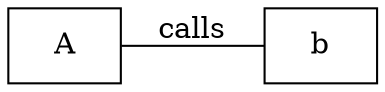

# Output Formats

Synaptic builds one in-memory knowledge graph and can serialize it to many artifacts. The canonical artifact is `graph.json` (a NetworkX node-link document); everything else is derived from the same graph.

Two ways to produce artifacts:

- `synaptic extract` writes a full default set in one pass (see [Extraction]).
- `synaptic export <format>` regenerates a single artifact from an existing `graph.json` without re-extracting, or pushes the graph live to a database.

For the visual/interactive artifacts (`graph.html`, `graph-3d.html`, `graph.svg`, `callflow.html`, `tree.html`) see [Visualizations].

## What `extract` writes by default

`synaptic extract` writes all of these into `synaptic-out/`:

```
graph.json        graph.html        GRAPH_REPORT.md
graph.graphml     graph.cypher      graph.dot
callflow.html     tree.html         graph.svg
graph-3d.html
```

`--obsidian` additionally writes `synaptic-out/obsidian/` and `--wiki` writes `synaptic-out/wiki/`. Neither is produced by default.

## The `export` command

```
synaptic export <format> [--graph <path>] [--out <path>] [--repo <tag>]
                          [--push <uri>] [--user <u>] [--password <p>]
```

`export` loads an existing `graph.json`, then re-emits one format from it. No re-extraction happens, so it is fast and deterministic.

Flags:

- `--graph <path>` source graph. Default: `synaptic-out/graph.json`.
- `--out <path>` output file (single-file formats) or directory (`obsidian`/`wiki`). Default: alongside the source graph, using the conventional filename for that format.
- `--repo <tag>` scope to one federated member by its `repo` tag before exporting (see [Workspaces-and-Federation]).
- `--push <uri>` for `neo4j`/`falkordb` only: push live to a running database instead of writing the cypher script. Requires the `push` build feature.
- `--user <u>` auth user for `--push` to Neo4j (default `neo4j`).
- `--password <p>` auth password for `--push` (or set `NEO4J_PASSWORD` / `FALKORDB_PASSWORD`).

### Full format list

Verified from the command dispatch, `export` accepts exactly these formats (case-insensitive):

| Format | Output | Notes |
| --- | --- | --- |
| `json` | `graph.json` | Pretty-printed node-link JSON |
| `html` | `graph.html` | Interactive 2D explorer (see [Visualizations]) |
| `svg` | `graph.svg` | Static layout (see [Visualizations]) |
| `graphml` | `graph.graphml` | Gephi / yEd / GraphML tools |
| `cypher` | `graph.cypher` | Neo4j / FalkorDB import script |
| `dot` | `graph.dot` | Graphviz DOT |
| `callflow` (alias `callflow-html`) | `callflow.html` | Mermaid call-flow (see [Visualizations]) |
| `tree` | `tree.html` | D3 file tree (see [Visualizations]) |
| `3d` (alias `force3d`) | `graph-3d.html` | 3D force graph (see [Visualizations]) |
| `obsidian` | `obsidian/` directory | Obsidian vault |
| `wiki` | `wiki/` directory | Markdown wiki |
| `report` | `GRAPH_REPORT.md` | Analysis report (see [Analysis-and-Reports]) |
| `neo4j` | `graph.cypher` or live push | See live push below |
| `falkordb` | `graph.cypher` or live push | See live push below |

Any other value is rejected with an error listing the valid formats.

### `--repo` scoping guard

`export json --repo X` with no `--out` is refused, because its default output name (`graph.json`) would overwrite the source graph with a scoped subgraph. Pass `--out <path>` to write the scoped graph elsewhere. Other formats have distinct default names and are unaffected.

## graph.json (the canonical artifact)

`graph.json` follows the NetworkX `node_link_data(G, edges="links")` shape. Top-level keys:

```json
{
  "directed": false,
  "multigraph": false,
  "graph": {},
  "nodes": [ ... ],
  "links": [ ... ],
  "hyperedges": [],
  "built_at_commit": "deadbeef"
}
```

- Edges are under `links` (not `edges`). On input, an `edges` key is accepted as an alias.
- `hyperedges` is always present, even when empty.
- `built_at_commit` is omitted when unknown.

### Node shape

Required keys are always present; optional keys are omitted when unset. Any other keys round-trip through a flattened `extra` map (so re-importing is lossless).

```json
{
  "id": "auth",
  "label": "auth.py",
  "file_type": "code",
  "source_file": "src/auth.py",
  "source_location": "L42",
  "community": 3,
  "repo": "app",
  "norm_label": "auth.py"
}
```

- `id` stable node identifier.
- `label` display name.
- `file_type` one of `code`, `document`, `paper`, `image`, `rationale`, `concept` (lowercase).
- `source_file` originating file path.
- `source_location` optional (e.g. a line marker); omitted when unset.
- `community` optional cluster id (integer); omitted when unset.
- `repo` optional federation tag; absent for single-repo graphs.
- `kind` optional node kind (`class`, `function`, `method`, `struct`, ...); set for code nodes in supported languages, omitted otherwise. See [Extraction].
- `visibility` optional declared visibility (`public`, `private`, `protected`, `internal`); omitted when unknown.
- `span` optional source range object (`start_line`, `start_col`, `end_line`, `end_col`); omitted when unknown. Lines-of-code is `end_line - start_line + 1`.
- `norm_label` lowercased search key, added by the JSON writer on export.

The `kind` (the node's `NodeKind`: `table`/`column`/`view`/`function`/`class`/… ) drives node **shape** and color-by-kind in the SVG, 2D, and 3D viewers, so the SQL and cross-language layers are visible — not just "code". SQL nodes also carry the facts the viewers surface on hover (`dialect`, `data_type`, `pk`, `fk_target`, `rls_enabled`, `security_invoker`). Non-code asset nodes carry `asset_kind` (e.g. `stylesheet`, `data`, `image`, `font`, `media`) for their own shapes; federated external-package stubs carry `external_package: true`.

### Link (edge) shape

```json
{
  "source": "a",
  "target": "b",
  "relation": "calls",
  "confidence": "EXTRACTED",
  "source_file": "src/a.py",
  "source_location": "L10",
  "confidence_score": 1.0,
  "weight": 1.0,
  "context": "...",
  "cross_repo": true
}
```

- `source` / `target` endpoint node ids.
- `relation` relationship name (e.g. `calls`, `contains`, `method`, `imports`).
- `confidence` one of `EXTRACTED`, `INFERRED`, `AMBIGUOUS` (uppercase).
- `source_file` where the relationship was found.
- `confidence_score` numeric score. The JSON writer defaults it from the confidence level when unset: `EXTRACTED` -> 1.0, `INFERRED` -> 0.5, `AMBIGUOUS` -> 0.2.
- `weight` defaults to 1.0.
- `source_location`, `context` optional, omitted when unset.
- `cross_repo` omitted when false; `true` marks a federated cross-repo edge.

### Hyperedge shape

```json
{ "id": "he1", "label": "auth cluster", "nodes": ["a", "b"] }
```

Optional `relation` and `confidence` keys are omitted when unset.

## graph.graphml

GraphML for Gephi, yEd, or any GraphML consumer. The document declares `<key>`s and emits `<node>`/`<edge>` data. Attributes preserved:

- Node: `label`, `file_type`, `source_file`, `community` (declared as `long`; `-1` when unset).
- Edge: `relation`, `confidence`.

For federated graphs only, two extra attributes are declared and emitted: a node `repo` (string) and an edge `cross_repo` (boolean, written only on cross-repo edges). Single-repo GraphML is unchanged. When any node carries enrichment metadata, three node attributes are also declared and emitted: `kind`, `visibility`, and `loc` (long). Cypher's rich (live-push) form sets the same `n.kind`/`n.visibility`/`n.loc`. Internal `_`-prefixed extras are dropped. All text is XML-escaped.

## graph.cypher

A Cypher import script for Neo4j or FalkorDB, generated as `;`-terminated statements: node `MERGE`s first, then edge `MERGE`s.

Both forms are idempotent on re-run. The `MERGE` key is the id alone, and `label`/`confidence` are applied with `SET`, so re-importing after a label or confidence change updates in place instead of duplicating. Node file type becomes the node label (capitalized, allowlisted; falls back to `Entity`), and the relation becomes the relationship type (uppercased, allowlisted; falls back to `RELATES_TO`).

```cypher
MERGE (n:Code {id: 'a'}) SET n.label = 'A';
MATCH (a {id: 'a'}), (b {id: 'b'}) MERGE (a)-[r:CALLS]->(b) SET r.confidence = 'EXTRACTED';
```

String values are escaped for single-quoted Cypher literals (drops control bytes; escapes `\`, `'`, newlines, CRs). Identifier-position tokens (node label, relationship type) are allowlisted to `[A-Za-z0-9_]` with a required leading letter, since Cypher cannot escape those positions.

The static script carries id + label on nodes only. The live push (see below) uses a richer form that also writes `source_file` and `community` onto nodes.

## graph.dot

Graphviz DOT. Renders a `digraph` (with `->`) when the graph is directed, otherwise a `graph` (with `--`). Layout hints `rankdir=LR` and `node [shape=box]` are emitted. Each node carries `label` and `kind` (the file type); each edge carries `label` (the relation).



Node ids and all attribute values are emitted as double-quoted DOT strings with `"`, `\`, and newlines escaped, so an arbitrary label cannot break the statement.

## Obsidian vault (`--obsidian` / `export obsidian`)

`to_obsidian` writes a directory (default `synaptic-out/obsidian/`) containing:

- One Markdown note per node, with YAML frontmatter (`id`, `file_type`, `community`, `source_file`) and neighbors as `[[wikilinks]]` grouped by relation. Incoming edges are grouped under `<relation> (in)`.
- One `_Community-<id>.md` overview note per community, with cohesion, a member list, a Dataview live query (`LIST FROM "" WHERE community = N`), and links to related communities by shared-edge count.
- `.obsidian/graph.json`, which colors the Obsidian graph view by community via a per-note frontmatter search.

Note filenames are sanitized from labels and deduped (colliding labels get a ` (N)` suffix), and wikilinks target the actual deduped filename so they resolve. `community_labels` supply semantic community names; when empty, names fall back to `Community N`. The function returns the count of notes written.

## Markdown wiki (`--wiki` / `export wiki`)

`to_wiki` writes a directory (default `synaptic-out/wiki/`) of GitHub-wiki-style Markdown with `[[wikilinks]]`:

- `index.md` listing communities and the top "key nodes" (highest degree).
- One `community-<id>.md` article per community, with cohesion score, key concepts (highest-degree members), spanned source files, related communities by shared-edge count, and an audit trail (the EXTRACTED/INFERRED/AMBIGUOUS mix of the community's internal edges).
- One page per "god node" (the top 10 highest-degree nodes overall), grouping neighbors by relation.

God-node filenames are deduped the same way as Obsidian notes. The function returns the count of files written.

## GRAPH_REPORT.md (`export report`)

A Markdown analysis report. `export report` recomputes communities and analysis from the loaded graph (these are not stored in `graph.json`) before writing. See [Analysis-and-Reports] for its contents.

## Neo4j / FalkorDB live push (`push` feature)

`export neo4j` and `export falkordb` write `graph.cypher` by default. With `--push <uri>` and a Synaptic binary built with `--features push`, they stream the graph into a running database instead. Both use the richer (props + community) idempotent `MERGE` statements, so re-runs upsert and never duplicate.

```
synaptic export neo4j    --push bolt://localhost:7687 --password <pw>
synaptic export falkordb --push falkordb://localhost:6379
```

Transports:

- Neo4j uses `cypher-shell` (must be on PATH; speaks Bolt). The `;`-terminated script is piped to its stdin. The URI is a Bolt URL (e.g. `bolt://localhost:7687`). Auth: `--user` (default `neo4j`) and `--password` or `NEO4J_PASSWORD`.
- FalkorDB uses the pure-Rust `redis` client, running each `MERGE` through `GRAPH.QUERY synaptic <stmt>`. The URI accepts `falkordb://`, `redis://`, `rediss://`, a bare `host:port`, or a bare `host` (default port 6379). Auth password is optional, taken from `--password` or `FALKORDB_PASSWORD`, and is set as a connection field (never interpolated into a URL), so passwords containing `@`/`:`/`/`/`%` connect correctly.

On success each prints the number of statements pushed. Without the `push` feature, `--push` fails with a clear message. See [Ingestion] and [MCP-Server] for related integrations.

## See also

- [Visualizations] for the interactive and static visual outputs.
- [Analysis-and-Reports] for GRAPH_REPORT.md.
- [Commands] for the full CLI reference.
- [Workspaces-and-Federation] for `--repo` scoping and cross-repo graphs.
